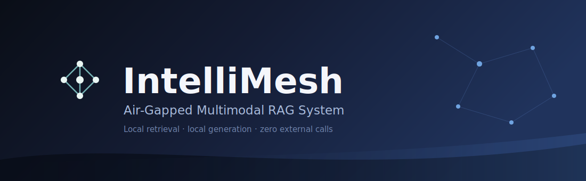
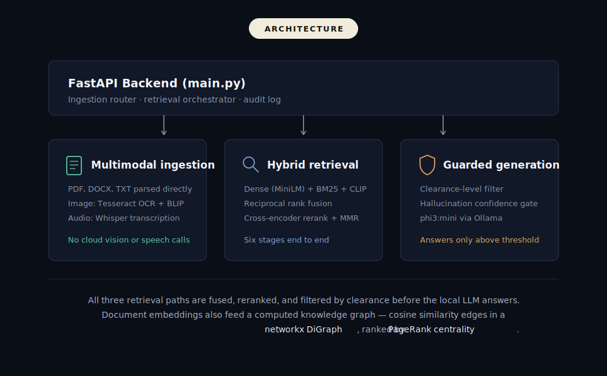

<div align="center">


<br/><br/>

<div align="center">


</div>

<br/>

[**Overview**](#overview) · [**Architecture**](#architecture) · [**Capabilities**](#capabilities) · [**Ablation Results**](#hallucination-guard--ablation-results) · [**Tech Stack**](#tech-stack) · [**Setup**](#setup)

</div>

<br/>

## Overview

IntelliMesh ingests PDFs, DOCX files, plain text, images, and audio, then answers questions about them using a fully local retrieval and generation pipeline. No document, embedding, or query ever leaves the machine — there is no external API dependency anywhere in the active code path, verified under both blocked and unblocked network conditions.


<br/>

## Capabilities

<table>
<tr><td width="30%"><b>Multimodal ingestion</b></td><td>PDF, DOCX, and TXT parsed directly. Images run through local Tesseract OCR and BLIP captioning. Audio transcribed with local Whisper. Zero cloud vision or speech APIs anywhere in the pipeline — the Gemini and Anthropic vision clients were removed entirely from the ingestion path.</td></tr>
<tr><td><b>Six-stage retrieval</b></td><td>Dense search (<code>all-MiniLM-L6-v2</code>) + sparse search (BM25) + visual search (CLIP) → Reciprocal Rank Fusion → cross-encoder reranking → MMR diversity selection.</td></tr>
<tr><td><b>Computed knowledge graph</b></td><td>Built with <code>networkx</code> as a real directed graph — not a mock payload. Document similarity is genuine cosine similarity between averaged chunk embeddings, citation edges carry real retrieval scores, and centrality is computed via PageRank with a degree-centrality fallback.</td></tr>
<tr><td><b>Hallucination guard</b></td><td>A confidence threshold on rerank scores gates whether the system answers or declines. Tuned via a 9-configuration, 36-query ablation sweep — see results below.</td></tr>
<tr><td><b>Clearance-level access control</b></td><td>Documents are tagged <code>UNCLASSIFIED</code>, <code>RESTRICTED</code>, or <code>CONFIDENTIAL</code>. Clearance is enforced as a live filter at query time across all three retrieval paths, not a label that goes unchecked.</td></tr>
<tr><td><b>Dashboard</b></td><td>React frontend with dark/light mode, a live ingestion log, and an interactive graph explorer that renders real centrality and edge-weight values rather than placeholder data.</td></tr>
</table>

**What it doesn't claim:** there is no prompt-injection sanitization in the current build — text goes from extraction to embedding untouched, which is a known gap rather than a shipped feature. The hallucination guard also trades against false refusals: short or sparse documents are more likely to be under-confidently declined even when retrieval finds the right chunk, a tradeoff measured directly in the ablation results below rather than a hidden failure mode

<br/>

## Hallucination guard — ablation results

Grid search over MMR λ and confidence threshold, evaluated on 36 queries spanning in-corpus and out-of-corpus questions.

| λ | Threshold | Retrieval Accuracy | False Refusal Rate | Hallucination Rate |
|:---:|:---:|:---:|:---:|:---:|
| 0.2 | 0.2 | 100.0% | 25.0% | 0.0% |
| 0.2 | 0.3 | 100.0% | 28.6% | 0.0% |
| 0.2 | 0.4 | 100.0% | 28.6% | 0.0% |
| 0.5 | 0.2 | 100.0% | 21.4% | 0.0% |
| 0.5 | 0.3 | 100.0% | 25.0% | 0.0% |
| 0.5 | 0.4 | 100.0% | 25.0% | 0.0% |
| **0.8** | **0.2** | **100.0%** | **10.7%** | **0.0%** |
| 0.8 | 0.3 | 100.0% | 14.3% | 0.0% |
| 0.8 | 0.4 | 100.0% | 14.3% | 0.0% |

Hallucination rate held at 0% across every configuration on this eval set. False-refusal rate is the real lever, ranging 10.7%–28.6% depending on λ and threshold. The system currently runs at λ=0.8, threshold=0.2 (bolded above) — the configuration with the lowest measured false-refusal rate (10.7%), confirmed in live testing after retuning from the previous default.
<br/>

## Architecture

<div align="center">

</div>

<details>
<summary>View diagram source (SVG)</summary>

```svg
<svg width="1000" height="620" viewBox="0 0 1000 620" xmlns="http://www.w3.org/2000/svg" font-family="-apple-system, Segoe UI, Roboto, Helvetica, Arial, sans-serif">
<title>IntelliMesh architecture</title>
<desc>FastAPI backend routes to multimodal ingestion, hybrid retrieval, and guarded local generation, with a computed knowledge graph built alongside ingestion.</desc>
<defs>
<marker id="arrow" viewBox="0 0 10 10" refX="8" refY="5" markerWidth="6" markerHeight="6" orient="auto-start-reverse">
<path d="M2 1L8 5L2 9" fill="none" stroke="#8b93a8" stroke-width="1.6" stroke-linecap="round" stroke-linejoin="round"/>
</marker>
</defs>

<rect width="1000" height="620" fill="#0a0e17"/>

<!-- pill label -->
<rect x="410" y="30" width="180" height="34" rx="17" fill="#f1ecdc"/>
<text x="500" y="52" text-anchor="middle" font-size="13" font-weight="700" letter-spacing="1.5" fill="#141410">ARCHITECTURE</text>

<!-- top box: FastAPI backend -->
<rect x="80" y="100" width="840" height="90" rx="10" fill="#111827" stroke="#2c3550" stroke-width="1"/>
<g>
<rect x="112" y="126" width="22" height="22" rx="4" fill="#3a6ea5"/>
<path d="M118 143 L128 131 M118 131 L128 143" stroke="#eaf2fb" stroke-width="1.6" stroke-linecap="round"/>
</g>
<text x="150" y="144" font-size="19" font-weight="700" fill="#f4f6fb">FastAPI Backend (main.py)</text>
<text x="150" y="169" font-size="14" fill="#8b93a8">Ingestion router &#183; retrieval orchestrator &#183; audit log</text>

<!-- three down arrows -->
<line x1="270" y1="190" x2="270" y2="222" stroke="#8b93a8" stroke-width="1.6" marker-end="url(#arrow)"/>
<line x1="500" y1="190" x2="500" y2="222" stroke="#8b93a8" stroke-width="1.6" marker-end="url(#arrow)"/>
<line x1="730" y1="190" x2="730" y2="222" stroke="#8b93a8" stroke-width="1.6" marker-end="url(#arrow)"/>

<!-- column 1: ingestion -->
<rect x="80" y="230" width="260" height="200" rx="10" fill="#111827" stroke="#2c3550" stroke-width="1"/>
<g transform="translate(110,258)">
<rect x="0" y="0" width="24" height="30" rx="3" fill="none" stroke="#5dcaa5" stroke-width="1.8"/>
<line x1="5" y1="8" x2="19" y2="8" stroke="#5dcaa5" stroke-width="1.3"/>
<line x1="5" y1="14" x2="19" y2="14" stroke="#5dcaa5" stroke-width="1.3"/>
<line x1="5" y1="20" x2="14" y2="20" stroke="#5dcaa5" stroke-width="1.3"/>
</g>
<text x="150" y="278" font-size="17" font-weight="700" fill="#f4f6fb">Multimodal ingestion</text>
<text x="112" y="316" font-size="13" fill="#8b93a8">PDF, DOCX, TXT parsed directly</text>
<text x="112" y="340" font-size="13" fill="#8b93a8">Image: Tesseract OCR + BLIP</text>
<text x="112" y="364" font-size="13" fill="#8b93a8">Audio: Whisper transcription</text>
<text x="112" y="400" font-size="13" fill="#5dcaa5">No cloud vision or speech calls</text>

<!-- column 2: retrieval -->
<rect x="370" y="230" width="260" height="200" rx="10" fill="#111827" stroke="#2c3550" stroke-width="1"/>
<g transform="translate(400,258)" stroke="#7fa3d8" stroke-width="1.8" fill="none">
<circle cx="10" cy="10" r="9"/>
<line x1="17" y1="17" x2="26" y2="26"/>
</g>
<text x="440" y="278" font-size="17" font-weight="700" fill="#f4f6fb">Hybrid retrieval</text>
<text x="402" y="316" font-size="13" fill="#8b93a8">Dense (MiniLM) + BM25 + CLIP</text>
<text x="402" y="340" font-size="13" fill="#8b93a8">Reciprocal rank fusion</text>
<text x="402" y="364" font-size="13" fill="#8b93a8">Cross-encoder rerank + MMR</text>
<text x="402" y="400" font-size="13" fill="#7fa3d8">Six stages end to end</text>

<!-- column 3: guardrails + LLM -->
<rect x="660" y="230" width="260" height="200" rx="10" fill="#111827" stroke="#2c3550" stroke-width="1"/>
<g transform="translate(692,256)" stroke="#e0a45a" stroke-width="1.8" fill="none">
<path d="M12 0 L24 5 V15 C24 24 18 30 12 32 C6 30 0 24 0 15 V5 Z"/>
</g>
<text x="730" y="278" font-size="17" font-weight="700" fill="#f4f6fb">Guarded generation</text>
<text x="692" y="316" font-size="13" fill="#8b93a8">Clearance-level filter</text>
<text x="692" y="340" font-size="13" fill="#8b93a8">Hallucination confidence gate</text>
<text x="692" y="364" font-size="13" fill="#8b93a8">phi3:mini via Ollama</text>
<text x="692" y="400" font-size="13" fill="#e0a45a">Answers only above threshold</text>

<!-- note line -->
<line x1="80" y1="460" x2="920" y2="460" stroke="#22293e" stroke-width="1"/>
<text x="500" y="500" text-anchor="middle" font-size="14" fill="#a9b2c8">All three retrieval paths are fused, reranked, and filtered by clearance before the local LLM answers.</text>
<text x="500" y="524" text-anchor="middle" font-size="14" fill="#a9b2c8">Document embeddings also feed a computed knowledge graph &#8212; cosine similarity edges in a</text>
<text x="500" y="548" text-anchor="middle" font-size="14" fill="#a9b2c8"><tspan fill="#e6f1fb">networkx DiGraph</tspan>, ranked by <tspan fill="#e6f1fb">PageRank centrality</tspan>.</text>

</svg>
```

</details>

<br/>

## Tech stack

<div align="center">


</div>

<div align="center">
<sub>FastAPI · ChromaDB · SentenceTransformers (<code>all-MiniLM-L6-v2</code>) · BM25 · CLIP · Cross-Encoder reranker (<code>ms-marco-MiniLM-L-6-v2</code>) · Tesseract OCR · BLIP (<code>Salesforce/blip-image-captioning-base</code>) · Whisper · Ollama (<code>phi3:mini</code>) · networkx · React + Vite</sub>
</div>

<br/>

## Setup

```bash
git clone https://github.com/Nandinisingh07/IntelliMesh.git
cd IntelliMesh/backend
pip install -r requirements.txt
ollama pull phi3:mini
uvicorn backend.main:app --reload

cd ../frontend
npm install
npm run dev
```

No API keys required. `HF_HUB_OFFLINE` and `TRANSFORMERS_OFFLINE` are set at startup, and the system makes zero outbound network calls at ingestion or query time — verified under both blocked and unblocked conditions.

<br/>

<br/>

<div align="center">
<sub>Built by <a href="https://github.com/Nandinisingh07">Nandini Singh</a></sub>
</div>
